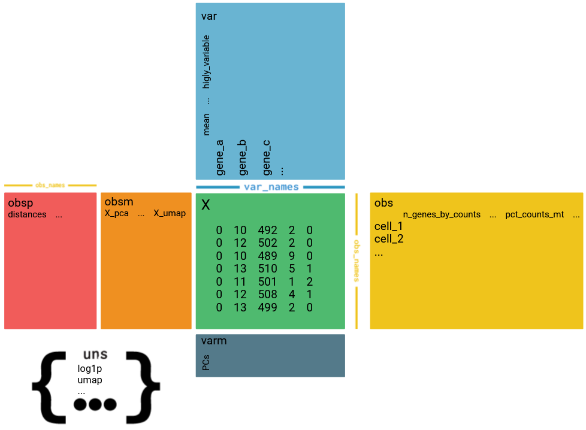

# Single-cell RNA-seq datas integration

Internship project to integrate differents datasets of single-cell RNA-seq. These scripts can process datas in the form of one cell per file (often Smart-seq) or in format of 10X (3 files : barcodes.tsv, genes.tsv, matrix.tsv). It could take all the technologies of single cell but in this 2 formats.

## Installation and Requirements

You have to download these directory and put your datas in a directory named Data. For format Smart_seq, named a dir **NumberOfDataset_Author_counts** and for 10X, **NumberOfDataset_Author_10X**. See the scheme below which explained the required organisation of the directory.

These scripts use the packages scanpy. For installing scanpy, you can use this command line in your terminal (on vs code terminal)
They also use packages tkfilebrowser and pywin32 (if you have Windows).

```
  pip install scanpy
  pip install tkfilebrowser
  pip install --upgrade pywin32
```

## Contents

- `apply_filters.py`: function to apply filters on anndata object on the minimum of genes per cell, the minimum of cells per genes and the maximum of % mitochondrial genes, generate a violin plot and ask the user if he want to save the filtered object (_filterd.h5ad)
- `gene_names.tab`: ouput of `extraction_gene_name.sh` (in the folder Appendix scripts) with in column 1 gene ids and column 2 gene names
- `create_anndata_object.py`: function to create anndata object to stock datas, generate a violin plot
- `create_umaps.py`: function to create umaps
- `generation_matrix.py`: function to create counts matrix from datasets with 1 cell per file, with columns represent cells and rows corespond to genes
- `main.py`: main script which call function and interact with the user
- `merge.py`: function to merge multiple anndata object, so it merged datasets, use `apply_filters.py`, `create_anndata_object.py`, `generation_matrix.py`, `main.py`, `merge.py`

## Data Processing Script

This script interacts with the user to process and analyze single-cell RNA sequencing datasets (Smart-seq2 or 10X). Follow the process to generate matrices, create objects, filter data, merge objects and create UMAPs.

## Usage

Execute `main.py` script and follow the processus to select the desired operation.
```
  python .\main.py
```

## Main Menu Options

At the beginning, a window appear and show folders in Processing. Here, you can create a folder or select an existing folder to save procssing files for a better tracability.

1. **Smart-seq2**
2. **10X**
3. **Apply filters**
4. **Merge existing objects only**
5. **Create UMAPs**

### Smart-seq2 format objects creation

1. **Generation of matrix in the case of a file per cell**
    - Displays the list of folders containing counts (e.g., `1_Deng_counts` in the Data folder). This applies to datasets with one cell per file in tabular format.
    - The script executes the `generation_matrix` function from the `generation_matrix.py` script to merge all files of the dataset into a matrix with genes in rows and cells in columns, replacing gene identifiers with gene names. The resulting file will be saved in the `Data_matrix_Smart_seq2` folder (e.g., `matrix_1_Deng.tab`). If matrices already exist, click on Cancel if your files already in matrix format.

2. **Creation of objects (AnnData)**
    - Show folder containing objects
    - Choose one or more objects
    - Creates objects in the `Objects` folder (e.g., `object_1_Deng_ori.h5ad`) and generates a violin plot in the `Plots` folder (e.g., `Plots_1_Deng`) using the `create_anndata_object` function from the `create_anndata_object.py` script.

  

### 10X format objects creation

- Choose one or more folders for process 10X
- Creates objects using the `create_anndata_object` function (similar to Smart-seq2).

### Filtering Data

- Choose one or more objects to add filters
- Requests filter parameters (minimum genes per cell, minimum cells per gene, and maximum percentage of mitochondrial genes).
- Executes the `apply_filters` function from the `apply_filters.py` script:
- Displays the number of cells and genes before and after filtering 
- Asks if the user wants to save the filtered object (e.g., `object_1_Deng_filtered_1.h5ad`) and saves a violin plot with the filter parameters in the name. Moreover, a log file is created with all the parameters choosen to a better tracability.

### Merging Objects

  - Displays objects folder
  - Choose one or more objects to merge (the best is to merge one object by one, not an already merge with another)
  - Merges objects using the `merge` function from the `merge.py` script and saves the merged object with the names of all included objects in the filename (e.g., `object_1_Deng_filtered_2_Chen_filtered_3_Mohammed_filtered_4_Nowo_merged_6_Posfai_filtered_10_Arg_filtered.h5ad`).

### Create UMAPs
  - Displays objects folder
  - Choose one object to create UMAPs.
  - Choose parameters : theta, number of clusters and a file containing list of genes (one per line)
  - Creates 2 UMAPs in Analysis/folder_name_at_the_beginning and a log file for tracability using `create_umaps.py`.
  - Ask if you want to create other UMAPs
  - If you want to change more precise parameters you can directly modify in the script (number of neighbors, number of PCs, show PCA plot, show Elbow plot
  
## Notes

- Ensure all necessary scripts (`generation_matrix.py`, `create_anndata_object.py`, `apply_filters.py`, `merge.py` and `main.py`) are available in the script directory.

