# Tutorial

Here, I explain in details all the steps on this program.

## Menu
When you execute `main.py`, a first window will open to inform you to choose a working folder. Click on OK

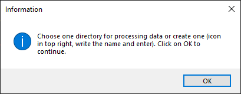

Then, here you can choose a working directory or create one by clicking on the icon in top right (red arrow). If you create one, enter a name, type enter on your keyboard to confirm, then select this new folder and click on **Open**.

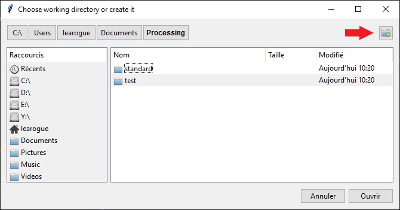

After, the Menu window appears and here you can choose one or few or all tasks and click on **Select**.

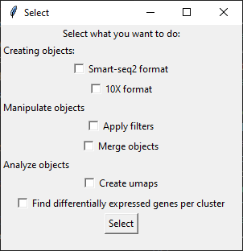

## Smart-seq2 format

### Generate matrix
If you have checked **Smart-seq2 format**, an information window will open to explain to choose folder(s) (_counts) to create a matrix if you have one file per cell, otherwise if you already have matrix, select nothing and click on Cancel on the next window and the processing will continue. This create a matrix with the number and the name of the counts folder in `Data`.

 >[!WARNING]
 > If you already have a matrix, it have to have genes names in rows and barcodes/cell ID in columns. If you have genes IDs, you can use `modify_ids_names.py` and enter at the beginning of the script the name of your input file and the output name like this: **matrix_Number_Author.tab**.

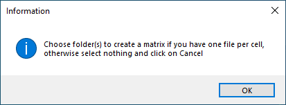 

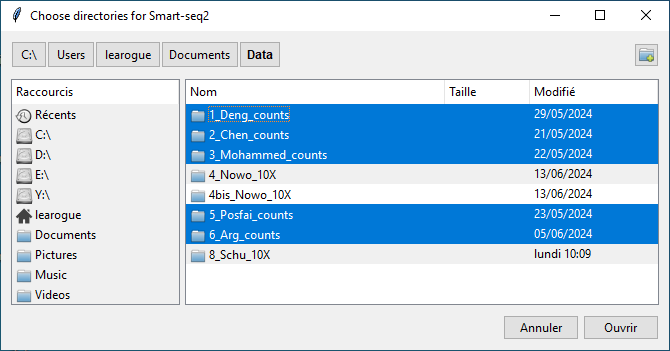

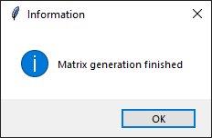

### Create objects
The next step is creating object from the matrix. An information window will open and explain the next step.

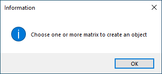

After, you select 1 or more matrix to create objects to pourchase processing and analysis.

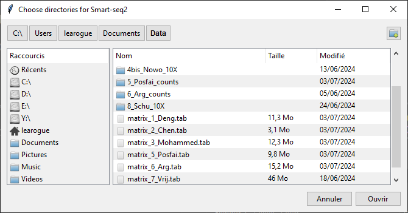

Object files will be in the working directory select or create at the begining in `Objects/` with the name `object_X_xxx_ori.h5ad`. It also generate a violin plot in `working_dir/Plots/X_xxx/` to see quality metrics of the dataset.

  > [!NOTE] 
  > You can read `.h5ad` file with Seurat if you use also this package in R.

## 10X format : Create objects
If you have check **10X format**, you have to put the 3 files in a folder named for exemple `4_Nowo_10X` which contain `barcodes.tsv`, `genes.tsv` and `matrix.mtx`.
Information window will open

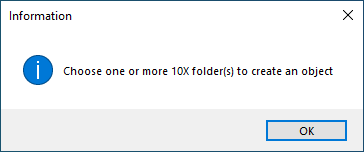

Then, you choose 1 or more 10X folders and like Smart-seq2 creating objects, it will generate an object and a violin plot.

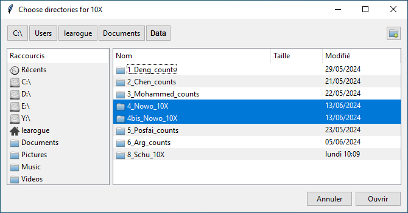

## Apply filters
If you have checked **Apply filters**, this step will add filters on objects already created.
Information window will open.

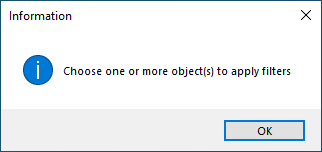

Then, select 1 or more objects for apply filters.

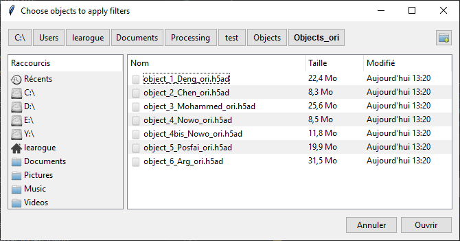

Enter the parameters for minimum number of genes per cells, minimum number of cells per genes and maximum percentages of mitochondrial genes.

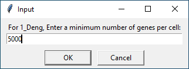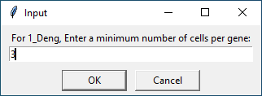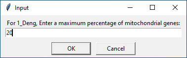

A window will open to show number of cells and genes before and after filters.

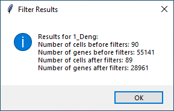

And it will be ask you if you want to save this filtered object.

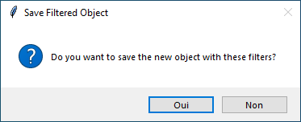

If yes, it save the object (`object_X_xxx_filtered_Y.h5ad`), generates a violin plot with parameters in the name of file, generates also a log file `filters_applied.tab` with parameters and number of genes and cells before and after filters.

If you have selected multiple objects these previous step will be repeated per object.

Information window:

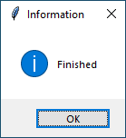

## Merge objects
If you have checked **Merge objects**, here it merge objects on genes. The best is to not take a already merge objects with a one dataset objects because it may be miss some genes or done errors.
Information window:

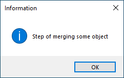

You choose objects you want to merge.

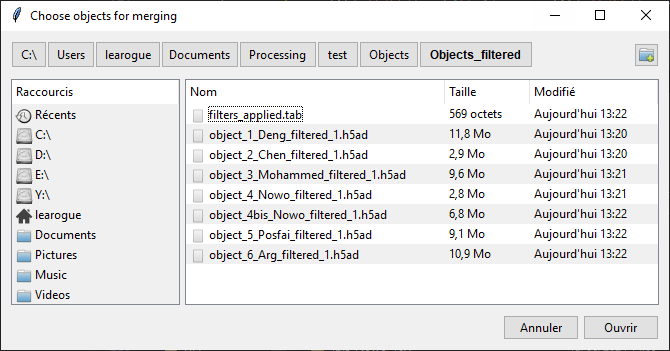

Step finished.

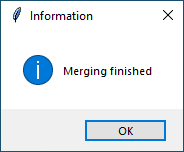

## Create UMAPs
If you have checked **Create UMAPs**, this step generates UMAPs with an object. Need a list of genes in folder `Analysis/` with one gene per line to create UMAPs with markers. This part use _Harmonypy_ to reduce batch effect of differents datasets. Harmony use an iterative method which adjust datas positions in reduce dimension (PCA) to correct batch effect but preserving biological variations. Harmony continue its iterations until adjustements converge.

Information window to start the step.

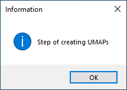

Select **1** object.

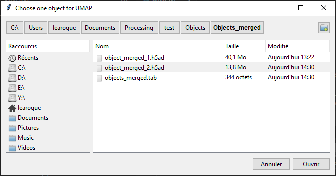

Enter the harmony parameters (theta and number of cluster) (see https://www.nature.com/articles/s41592-019-0619-0 for more precision). 
Theta is a regularization parameter that adjusts the strength of the batch effects correction. The higher the theta value, the stricter the correction, which can lead to better homogeneity between batches, but also to a risk of over-correction, where relevant biological variations may be lost. Conversely, a lower theta value means a less aggressive correction, which can preserve more biological variations but also leave batch effects.

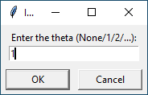

The number of cluster (nclust) represent the number of clusters use by Harmony to regroup datas at the begining of crrection process and adjsut this initail clusters to correct batch effects. Too few clusters (low nclust) can lead to over-correction, where significant biological variations are mitigated because separate data groups are improperly merged. Too many clusters (high nclust value) can lead to under-correction, where batch effects are not sufficiently mitigated because the data is aggregated too thinly.

  > [!NOTE] 
  > If you want to modify more precise parameters you can modify others precise parameters (number of neighbors and number of PCs) or to see PCA plot and Elbow plot. At the begining of `create_umaps.py`, there are variables which can be modify (you don't need to modify in the command lines)

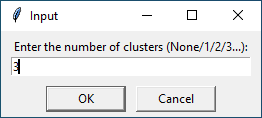

Information window to guide you.

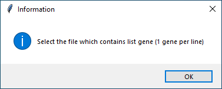

Select the list gene file.

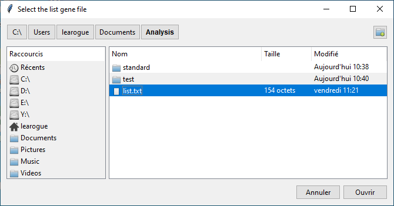

Step finished. So the program creates 2 UMAPs in `Analysis/working_dir/UMAPs`, one for show different datasets and louvain (clustering) and the second with gene list for expression. It also generates a log file to trace all the parameters.

Information:

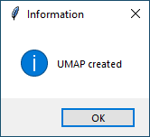

Here, program asks if you want to create others UMAPs (avoid to lauch at each time). If yes, it remake precedent step. If no, finished the program 

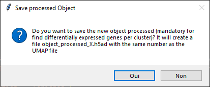

Here, program asks if you want to create others UMAPs (avoid to lauch at each time). If yes, it remake precedent step. If no, finished the program 

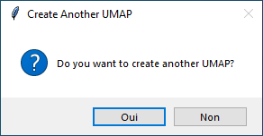

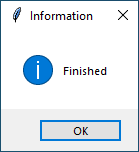

## Find differentially expressed genes

You select the object that you want to have the differentail expression

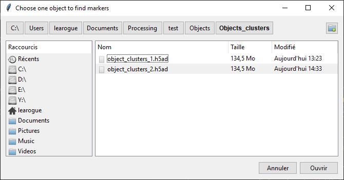

Finished

## Following steps

Next step of analysis is renaming clusters thanks to marker genes and there is no standard and it depends on many things so it's very difficult to make that automatic, it's easier for you to continue your analysis with your own command lines in a notebook for exemple (you can see exemples in the git https://github.com/learogue/Results_scRNAseq_m1_internship).
