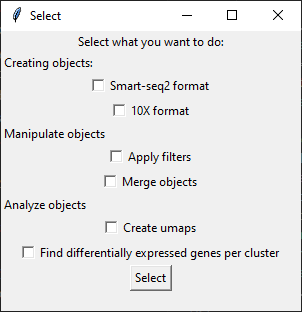

# Tutorial

Here, I explain in details all the steps on this little program.

## Menu
When you execute `main.py`, a first window will be open to inform you to choose a working folder. Click on OK

## Smart-seq2 format
