# Tutorial

Here, I explain in details all the steps on this little program.

## Menu
When you execute `main.py`, a first window will be open to inform you to choose a working folder. Click on OK

Then, here you can choose a working directory or create one by clicking on the icon in top right (red arrow), enter a name and type enter on your keyboard and then select this new folder and click on **Open**.

After, the Menu window appears and here youi can choose 1 or all tasks and click on **Select**.

## Smart-seq2 format

### Generate matrix
If you have check **Smart-seq2 format**, an information window will open to explain you to Choose folder(s) (_counts) to create a matrix if you have one file per cell, otherwise if you already have matrix, select nothing and click on Cancel on the next window and the processing will continue. This create a matrix with the number and the name of the counts folder in `Data`.
**Warning** Your matrix have to have genes names in rows and barcodes/cell ID in columns. If you have genes IDs, you can use `modify_ids_names.py` and enter at the beginning of the script the name of your input file and the output name like this: **matrix_Number_Author.tab**.

 

### Create objects
The next step is creating object from the matrix. An information window will open and explain the nexte step.

After, you select 1 or more matrix to create objects to pourchase processing and analysis.

Object files will be in the working directory select or create at the begining in `Objects/` with the name `object_X_xxx_ori.h5ad`. It also generate a violin plot in `working_dir/Plots/X_xxx/` to see quality metrics of the dataset.

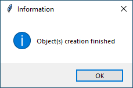

  > [!NOTE] 
  > You can read `.h5ad` file with Seurat if you use also this packages in R.

## 10X format : Create objects
If you have check **10X format**, you have to put the 3 files in a folder named for exemple `4_Nowo_10X` which contain `barcodes.tsv`, `genes.tsv` and `matrix.mtx`.
Information window will open

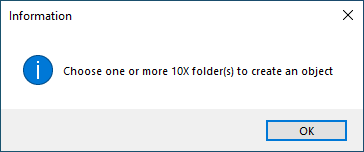

Then, you choose 1 or more 10X folders and like Smart-seq2 creating objects, it will generate an object and a violin plot.

## Apply filters
If you have check **Apply filters**, this step will add filters on objects already created.
Information window will open.

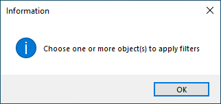

Then, select 1 or more objects for apply filters.

Enter the parameters for minimum number of genes per cells, minimum number of cells per genes and maximum percentages of mitochondrial genes.

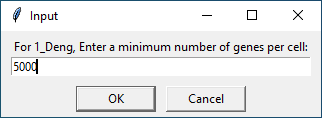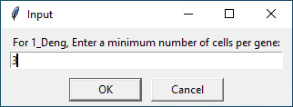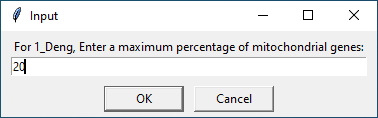

A window will open to show number of cells and genes before and after filters.

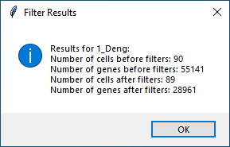

And it will be ask you if you want to save this filtered object.

If yes, it save the object (`object_X_xxx_filtered_Y`), generates a violin plot with parameters in the name of file, generates also a log file `filters_applied.tab` with parameters and number of genes and cells before and after filters.

If you have select multiple objects these previous step will be repeated per object.

Information window:

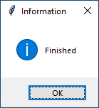

## Merge objects

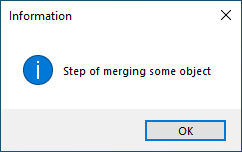

## Create UMAPs
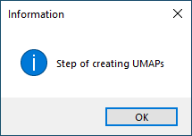

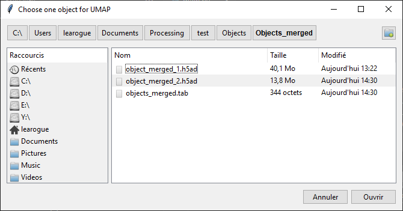

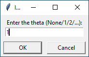

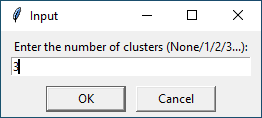

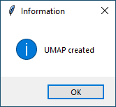

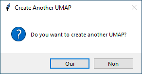
